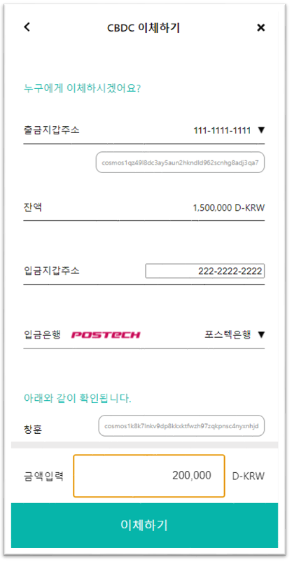
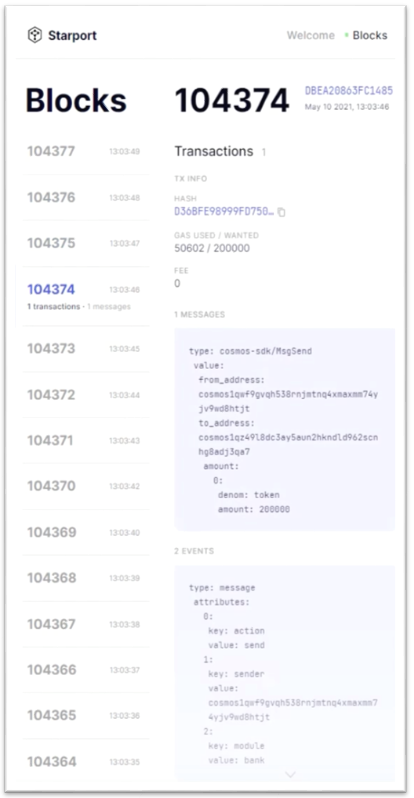

# cosmos-cbdc
CBDC demo project made by cosmos-sdk

## TODO
1. CBDC 발행
   - [x] 시중은행에서 CBDC 발행 요청하는 page 추가
   - [x] 중앙은행에서 CBDC 발행 요청 처리하는 page 추가
   - [x] CBDC Blockchain 연결
   - [x] 시중은행의 중앙은행 당좌예금 page 추가
2. CBDC 환수
   - [x] 시중은행에서 CBDC 환수 요청하는 page 추가
   - [x] 중앙은행에서 CBDC 환수 요청 처리하는 page 추가
3. CBDC 송금 및 대금결제 취소
   - [x] 시중은행 Escrow account 추가
   - [x] User 화면에서 결제 취소 요청하는 기능 추가
   - [x] 상점 화면에서 결제 취소 승인/거절하는 page 추가
   - [x] 3일 지났을 시 재입금하는 스마트 컨트랙트 작성
   - [x] 디자인 요청 반영
4. CBDC 해외송금
   - [ ] Klaytn Testnet(Baobab) 노드 구성, Wallet 발행 - `해당 작업중`
   - [ ] LFB-SDK를 사용해서 독자적인 Testnet 구성, Wallet 발행
   - [ ] Klaytn과 LINE 블록체인과 Cosmos 블록체인 간의 정보 교환 기능 추가

## Build Environment
- node: 14.17.5
- npm: 6.14.14
- go: 1.16.5
- python2: 2.7.18
- starport: 0.14.0

# 파일 설명

CBDC_server :  코스모스 블록체인에 쿼리를 보낼 서버

CBDC_admin : 은행 관리 시나리오 데모

CBDC_user : 유저 서비스 데모

dpnmd : CBDC 코스모스 블록체인

# 실행 방법

## shell 1 서버 실행

Admin port : 3001 

User port : 3002

Server port : 3030


## shell 2 Cosmos 블록체인 실행

```
starport serve
``` 

만약 블록이 생성 되지 않는 다면 다른 shell에서 아래와 같은 명령어 실행 시 블록이 생성됨 (에러 메시지가 Trigger 역할을 하는 듯함..)

dpnm은 cosmos-SDK chain 생성 시 초기 세팅한 이름임. 자유롭게  

```
dpnmd start
``` 

# 실행 결과

## 실행 이미지(Kor ver.)




## 데모 영상 

[유튜브](https://www.youtube.com/watch?v=DqvWH7rcHTU)
